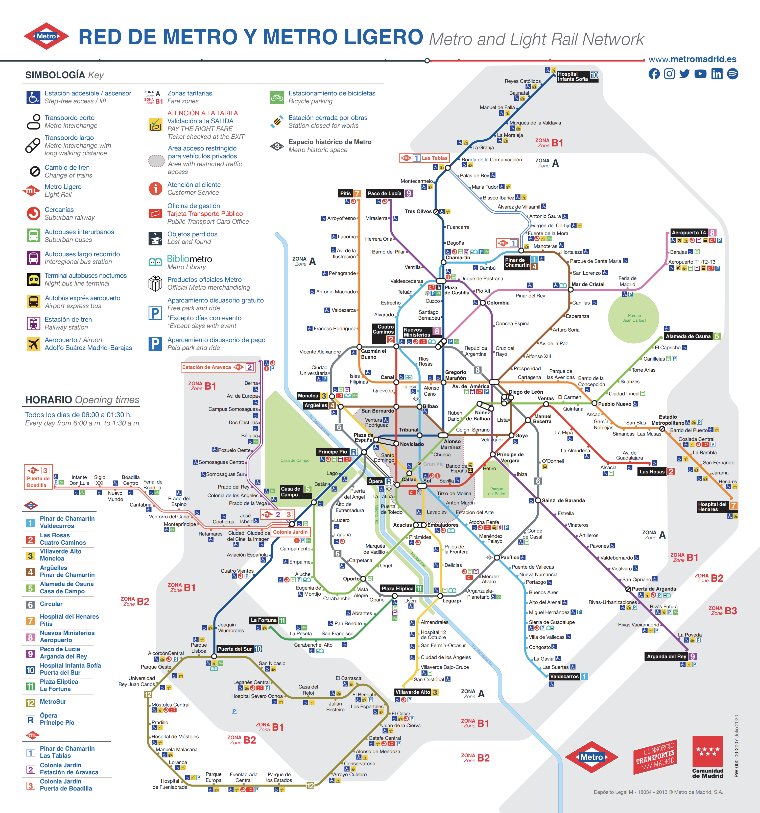
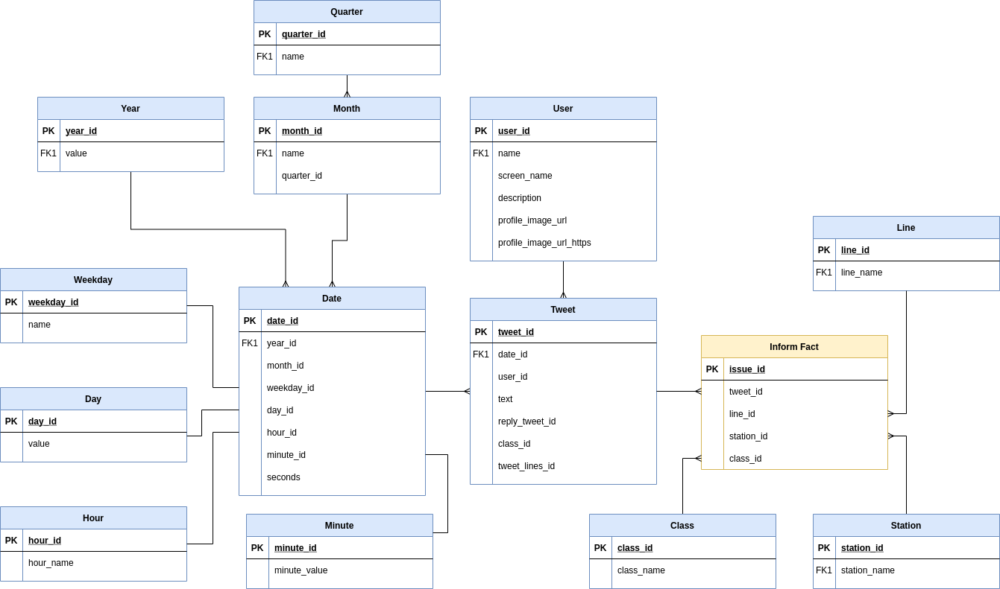

# udacity-dend-capstone-project <a class="anchor" id="top"></a>

## Table of content
* [Conceptual Data Model](#conceptual-data-model)
* [Data dictionary](#data-dict)
***

This notebook gets output data from [metro-big-data-unir](https://github.com/juananthony/metro-big-data-unir) project and create a database to analysis.

[*Metro de Madrid*](https://www.metromadrid.es/) is the name of the tube/subway service that operates in Madrid, Spain. This service has 302 stations on 13 lines plus a light rail system called *Metro Ligero*. This service is used, on average in 2020, more than 30 million times each month.



***
[Back to top](#top)
# Conceptual Data Model <a class="anchor" id="conceptual-data-model"></a>
The data we want to store is all messages that inform about any issue or complaint in a line or a station even if one message inform about an issue that affect two different lines. That the reason why the fact table is the inform fact, that can be a complaint or an issue. One tweet can inform about an issue that affect two lines (i.e.: a closed station and all lines that stops there). In other words, one tweet generates one or many "inform fact" records.



***
[Back to top](#top)
# Data dictionary<a class="anchor" id="data-dict"></a>

## Dimension Tables

* **Line**
    * ```line_id```
        * ```Integer```
        * Line identifier.
    * ```line_name```
        * ```String```
        * Line name.
    * ```regex```
        * ```String```
        * Regex to search the line in a text.
* **Station**
    * ```Integer```
        * ```Long```
        * Station identifier.
    * ```station_name```
        * ```String```
        * Station name.
    * ```regex```
        * ```String```
        * Regex to search the station in a text.
* **Class**
    * ```class_id```
        * ```Integer```
        * Station identifier.
    * ```class_name```
        * ```String```
        * Station identifier.
* **User**
    * ```user_id```
        * ```Long```
        * User identifier.
    * ```user_name```
        * ```String```
        * User name.
    * ```screen_name```
        * ```String```
        * User unique string identifier.
    * ```description```
        * ```String```
        * User description.
    * ```profile_image_url```
        * ```String```
        * URL of profile image (HTTP protocol).
    * ```profile_image_url_https```
        * ```String```
        * URL of profile image (HTTPS protocol).
* **Date**
    * ```date_id```
        * ```Long```
        * Date identifier.
    * ```year```
        * ```Integer```
        * Year number (i.e.: 2019, 2020, 2021, ...).
    * ```quarter```
        * ```Integer```
        * Quarter of the year (i.e.: 1, 2, ...).
    * ```month```
        * ```Integer```
        * Month of the year as integer (i.e.: 1, 2, 3, 4, ...).
    * ```weekday```
        * ```Integer```
        * Day of the week (Sunday=1, Monday=2, ..., Saturday=7).
    * ```day```
        * ```Integer```
        * Day of the month (1, 2, 3, ...).
    * ```hour```
        * ```Integer```
        * Hour in 24-hour format (i.e.: 0, 1, 2, ..., 12, 13, 14, ..., 22, 23).
    * ```minute```
        * ```Integer```
        * Minute (i.e.: 0, 1, 2, 3, 4, ..., 59)
* **Tweet**
    * ```tweet_id```
        * ```Long```
        * Tweet identifier.
    * ```date_id```
        * ```Long```
        * Date id when the tweet was created.
    * ```user_id```
        * ```Long```
        * User id who is author of this tweet.
    * ```text```
        * ```String```
        * Tweet text.
    * ```reply_tweet_id```
        * ```Long```
        * If this tweet is a reply, this field references the tweet_id that this tweet is replying.


## Fact Table

* **Inform**
    * ```issue_id```
        * ```Long```
        * Inform identifier.
    * ```tweet_id```
        * ```Long```
        * Tweet id that informs about a issue or complaint.
    * ```line_id```
        * ```Long```
        * Service line id.
    * ```station_id```
        * ```Long```
        * Station id.
    * ```class_id```
        * ```Long```
        * If this tweet is a reply, this field references the tweet_id that this tweet is replying.
