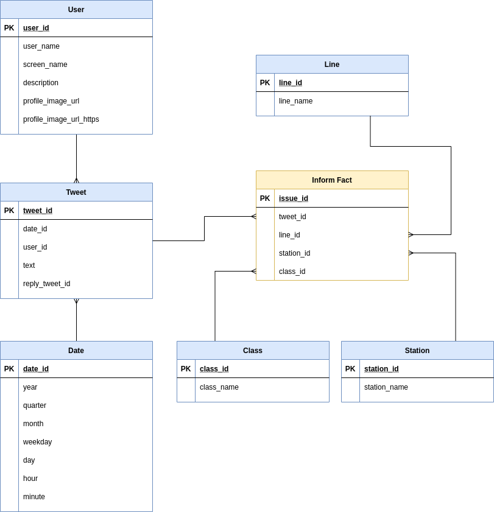

# udacity-dend-capstone-project <a class="anchor" id="top"></a>

>**Important**: ```data/mentions_20210210.csv``` needs to be extracted from [mentions_20210210.7z](./data/mentions_20210210.7z) file. This file can't be pushed to GitHub because it is greated than the 100Mb Github limit.

## Table of content
* [Conceptual Data Model](#conceptual-data-model)
* [Data dictionary](#data-dict)
* [Project Write Up](#project-write-up)
***

This project is [this notebook](./Capstone&#32;Project.ipynb) that gets output data from [metro-big-data-unir](https://github.com/juananthony/metro-big-data-unir) project and create a model for a data lake. The used data is based on all mentions on Twitter to offcial account of Metro de Madrid service.

[*Metro de Madrid*](https://www.metromadrid.es/) is the name of the tube/subway service that operates in Madrid, Spain. This service has 302 stations on 13 lines plus a light rail system called *Metro Ligero*. This service was used in 2019 more than 677 million times.


[metro-big-data-unir](https://github.com/juananthony/metro-big-data-unir) project collects tweets from Twitter. Tweets which [@metro_madrid](https://twitter.com/metro_madrid) account is mentioned. Many messages in this social network used to be complaints about the service quality (broken mechanic stairs or air conditionar, ...), other tweets mentioned some issue in the service (huge delays in a line, ...). This project uses NLP techniques to detect those messages where an issue or complaint is mentioned to [@metro_madrid](https://twitter.com/metro_madrid) account and store all of them in a MongoDB database.

This notebook uses a CSV export of data stored in MongoDB instance. All this messages are classfied previously by [metro-big-data-unir](https://github.com/juananthony/metro-big-data-unir).

***
[Back to top](#top)
# Conceptual Data Model <a class="anchor" id="conceptual-data-model"></a>
The data we want to store is all messages that inform about any issue or complaint in a line or a station even if one message inform about an issue that affect two different lines. That the reason why the fact table is the inform fact, that can be a complaint or an issue. One tweet can inform about an issue that affect two lines (i.e.: a closed station and all lines that stops there). In other words, one tweet generates one or many "inform fact" records.



***
[Back to top](#top)
# Data dictionary<a class="anchor" id="data-dict"></a>

## Dimension Tables

* **Line**
    * ```line_id```
        * ```Integer```
        * Line identifier.
    * ```line_name```
        * ```String```
        * Line name.
    * ```regex```
        * ```String```
        * Regex to search the line in a text.
* **Station**
    * ```Integer```
        * ```Long```
        * Station identifier.
    * ```station_name```
        * ```String```
        * Station name.
    * ```regex```
        * ```String```
        * Regex to search the station in a text.
* **Class**
    * ```class_id```
        * ```Integer```
        * Station identifier.
    * ```class_name```
        * ```String```
        * Station identifier.
* **User**
    * ```user_id```
        * ```Long```
        * User identifier.
    * ```user_name```
        * ```String```
        * User name.
    * ```screen_name```
        * ```String```
        * User unique string identifier.
    * ```description```
        * ```String```
        * User description.
    * ```profile_image_url```
        * ```String```
        * URL of profile image (HTTP protocol).
    * ```profile_image_url_https```
        * ```String```
        * URL of profile image (HTTPS protocol).
* **Date**
    * ```date_id```
        * ```Long```
        * Date identifier.
    * ```year```
        * ```Integer```
        * Year number (i.e.: 2019, 2020, 2021, ...).
    * ```quarter```
        * ```Integer```
        * Quarter of the year (i.e.: 1, 2, ...).
    * ```month```
        * ```Integer```
        * Month of the year as integer (i.e.: 1, 2, 3, 4, ...).
    * ```weekday```
        * ```Integer```
        * Day of the week (Sunday=1, Monday=2, ..., Saturday=7).
    * ```day```
        * ```Integer```
        * Day of the month (1, 2, 3, ...).
    * ```hour```
        * ```Integer```
        * Hour in 24-hour format (i.e.: 0, 1, 2, ..., 12, 13, 14, ..., 22, 23).
    * ```minute```
        * ```Integer```
        * Minute (i.e.: 0, 1, 2, 3, 4, ..., 59)
* **Tweet**
    * ```tweet_id```
        * ```Long```
        * Tweet identifier.
    * ```date_id```
        * ```Long```
        * Date id when the tweet was created.
    * ```user_id```
        * ```Long```
        * User id who is author of this tweet.
    * ```text```
        * ```String```
        * Tweet text.
    * ```reply_tweet_id```
        * ```Long```
        * If this tweet is a reply, this field references the tweet_id that this tweet is replying.


## Fact Table

* **Inform**
    * ```issue_id```
        * ```Long```
        * Inform identifier.
    * ```tweet_id```
        * ```Long```
        * Tweet id that informs about a issue or complaint.
    * ```line_id```
        * ```Long```
        * Service line id.
    * ```station_id```
        * ```Long```
        * Station id.
    * ```class_id```
        * ```Long```
        * If this tweet is a reply, this field references the tweet_id that this tweet is replying.

***
[Back to top](#top)
# Project Write Up <a class="anchor" id="project-write-up"></a>

This project uses [Apache Spark](https://spark.apache.org/) to process large amount of date. This dataset is not quite large yet but it grows every day. In the future, other tube services from other cities can be integrated in the system and increase the number of tweets to process.

When the record number increase by 100x, more executors need to be added. Also, in order to have a dashboard feeded by data and updated daily or hourly, [Apache Airflow](https://airflow.apache.org/) is needed to orchestrate MongoDB extraction, transformation and cleaning steps, etc.

Now, the database is stored in parquet files. But when it is accessed by 100+ people, the data must be migrated to another system (Redshift, HDFS, etc.)
